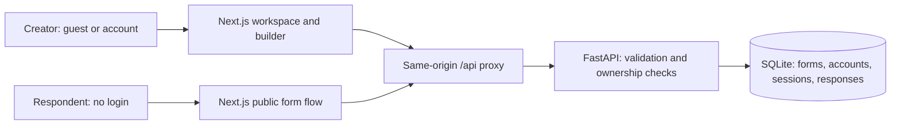

# iLoveForms

A full-stack Typeform-style form builder built for the SDE Fullstack Assignment. Creators can design and publish forms, respondents complete a conversational one-question-at-a-time flow, and creators review persisted submissions.

- **Source:** [GitHub repository](https://github.com/kartikjuneja05/scalar-ai-typeform-clone)
- **Hosted demo:** [iLoveForms](https://scalar-ai-typeform-clone.vercel.app/)

## Features

- Form management: create, rename, duplicate, delete, search, filter, and publish/unpublish forms.
- Three-panel builder with drag-and-drop question ordering, editable descriptions, required toggles, choice settings, and live preview.
- Eight question types: short text, long text, multiple choice, dropdown, email, number, yes/no, and rating.
- Conversational public forms with animated transitions, keyboard navigation, progress, validation, and a thank-you screen.
- Results table, individual response details, per-question count summaries, and CSV export.
- Four themes and configurable thank-you text.
- Account registration, sign-in, sign-out, and a default **guest** workspace. Respondents never need an account.

## Tech stack

| Layer | Technology |
| --- | --- |
| Frontend | Next.js 16, React 19, TypeScript, CSS, Lucide icons |
| Backend | Python, FastAPI, Pydantic, Uvicorn |
| Database | SQLite with foreign keys and write-ahead logging (WAL) |
| Authentication | Opaque cookie sessions; salted PBKDF2-HMAC-SHA256 password hashes |
| Deployment | Vercel frontend; Render backend with persistent SQLite storage |
| Validation | Python unittest API tests; TypeScript checking; Next.js production build |

## Setup instructions

### Prerequisites

- Node.js 22.x and npm
- Python 3.14 (the configured deployment and CI version)
- Git

Clone the repository and enter its root:

```bash
git clone git@github.com:kartikjuneja05/scalar-ai-typeform-clone.git
cd scalar-ai-typeform-clone
```

### Backend

In the first terminal:

```bash
cd backend
python3 -m venv .venv
source .venv/bin/activate
pip install -r requirements.txt
uvicorn main:app --host 127.0.0.1 --port 8000
```

On Windows, activate the environment with `.venv\Scripts\activate` instead.

### Frontend

In a second terminal, from the repository root:

```bash
cd frontend
npm ci
npm run dev
```

Open [localhost:3000](http://localhost:3000). Interactive API documentation is available at [localhost:8000/docs](http://localhost:8000/docs).

### Configuration and sample data

| Variable | Service | Default / usage |
| --- | --- | --- |
| `API_URL` | Frontend | Defaults to `http://127.0.0.1:8000`; set to the backend origin when hosting, without `/api` |
| `DATABASE_PATH` | Backend | Defaults to `backend/forms.sqlite3`; use a persistent disk path when hosting |
| `COOKIE_SECURE` | Backend | Defaults to `false` for local HTTP; set to `true` on hosted HTTPS |

The backend reads process environment variables; `backend/.env.example` is a reference and is not automatically loaded. Restart the backend after changing its configuration. Redeploy the frontend after changing `API_URL`, because it configures build-time rewrites.

On first initialization, the database seeds **two published forms, one draft, and ten responses**. The first guest workspace receives the sample forms. Samples are not recreated after deletion or on subsequent restarts. New accounts receive two editable starter drafts: “A little about you” and “Customer happiness check-in,” with five questions each and no sample responses. Inherited forms with those titles are kept instead of duplicated; signing in again does not recreate deleted starters.

### Suggested evaluation flow

1. Open the workspace as guest and inspect the seeded forms and results.
2. Create a form, add several question types, reorder them, and preview the flow.
3. Register an account and confirm the guest-created forms remain available.
4. Save and publish a form, then open its share link in a private browser window.
5. Submit without signing in; verify required fields, email/number validation, and keyboard navigation.
6. Inspect the submission, summary counts, and CSV export in the creator workspace.
7. Edit a draft and confirm the public form changes only after republishing; unpublish to disable public access.

### Run checks

From the repository root:

```bash
cd backend
source .venv/bin/activate
pip install -r requirements-dev.txt
python -m unittest discover -s tests -v
cd ../frontend
npm run typecheck
npm run build
```

The backend suite contains 19 tests covering form operations, publication, validation, response persistence, CSV export, authentication, session behavior, ownership isolation, and legacy database initialization. GitHub Actions runs backend tests, frontend type checking, and the production build.

## Architecture overview



### Frontend

`frontend/app/page.tsx` manages the workspace, builder, sharing, and results views. `frontend/components/Flow.tsx` supplies the shared respondent experience for previews and public pages under `/f/<form-id>`. `AccountDialog.tsx` handles registration and sign-in, while `model.ts` defines frontend types and API helpers.

Next.js rewrites `/api/*` requests to FastAPI. Browser requests remain on the frontend origin, including session-cookie requests.

### Backend and publication pipeline

`backend/main.py` implements form and response APIs, validates definitions with Pydantic, and validates submissions against the published question configuration. `backend/auth.py` manages creator identities, password verification, sessions, and guest-to-account transitions.

Saving updates the editable draft. Publishing stores a separate JSON snapshot and increments the publication version. Public readers see that snapshot, so unsent draft edits do not affect live forms. Submissions include the version they loaded; a stale version returns **409 Conflict**. Each accepted response stores its own immutable definition snapshot so historical question wording remains available after edits.

Database transactions make multi-row saves and submissions atomic. Publishing and submissions acquire a write lock before checking the version. Creator endpoints enforce ownership; public reading and submission require no authentication.

### Creator sessions

A new browser receives a guest identity named `guest`. Registration upgrades that identity and preserves its forms. Signing into an existing account transfers the current browser's guest forms to that account. Signing out starts a new guest workspace.

Passwords use salted PBKDF2-HMAC-SHA256 with 600,000 iterations. Only SHA-256 digests of random session tokens are stored. Cookies are HttpOnly, SameSite=Lax, and Secure when configured for HTTPS. Sessions expire after 30 days.

## Database schema

| Table | Key fields and relationships |
| --- | --- |
| `creators` | `id` primary key, `name`, unique nullable `email`, nullable `password_hash`, `is_guest` |
| `sessions` | `token_hash` primary key, `creator_id` foreign key to creators, `expires_at`; deleting a creator cascades sessions |
| `forms` | `id` primary key, `owner_id` foreign key to creators, title, theme, thank-you text, status, version, published snapshot, creation/update timestamps |
| `questions` | Composite primary key `(form_id, id)`; `form_id` foreign key to forms; unique `(form_id, position)`; JSON definition containing type, settings, and options |
| `responses` | `id` primary key; `form_id` foreign key to forms; publication version, submission timestamp, immutable JSON definition snapshot |
| `answers` | Composite primary key `(response_id, question_id)`; `response_id` foreign key to responses; JSON answer value |
| `app_meta` | `key` primary key and `value`; stores the seed initialization marker |

Relationships: a creator owns many forms; a form has many ordered questions and responses; a response has many answers. Answer question IDs refer to the response's immutable snapshot rather than mutable draft question rows. Deleting a form cascades its questions, responses, and answers. Duplicating creates a draft without copying submissions.

Foreign-key enforcement is enabled on each connection. Indexes cover form ownership, creator sessions, and response retrieval by form and submission time. SQLite stores both account data and form data in the same database file.

## API overview

The endpoints below are prefixed with `/api`. Full request/response schemas are available through FastAPI's `/docs` page.

| Method | Endpoint | Purpose |
| --- | --- | --- |
| GET | `/auth/session` | Return the current profile or establish a guest session |
| POST | `/auth/register` | Register with `{name, email, password}` and preserve guest forms |
| POST | `/auth/login` | Sign in with `{email, password}` |
| POST | `/auth/logout` | Revoke the current session and start a guest workspace |
| GET / POST | `/forms` | List owned forms / create acle form |
| GET / PUT / DELETE | `/forms/{id}` | Read / save / delete an owned form |
| POST | `/forms/{id}/duplicate` | Duplicate into a draft without responses |
| POST | `/forms/{id}/publish` | Publish a versioned snapshot |
| POST | `/forms/{id}/unpublish` | Disable public access and submissions |
| GET | `/forms/{id}/responses` | Retrieve owned form submissions and their snapshots |
| GET | `/forms/{id}/export` | Download response CSV |
| GET | `/public/{id}` | Read a published form without a session |
| POST | `/public/{id}/responses` | Submit `{answers, version}` without a session |
| GET | `/health` | Check service and database availability |

Creator routes accept guest or registered sessions and restrict access to the current owner's forms. Public routes do not establish or require creator sessions. Validation errors reject malformed definitions and answers; missing, inaccessible, or unpublished forms return 404 where appropriate.

## Assumptions and limitations

- Guests can build forms without registering. Their workspace depends on retaining the session cookie; accounts provide access across browsers. Existing unowned forms are assigned to the first guest opening an installation after the account migration.
- Saving is explicit; leaving the editor saves pending changes. Concurrent creator edits can overwrite each other.
- Completed submissions are stored in SQLite; durability depends on the hosting storage described below. Partial answers stay in browser memory; partial-response tracking and completion rates are not implemented.
- Summary counts aggregate by question ID across publication versions. Responses have no pagination or submission idempotency mechanism.
- Logic branching, integrations/webhooks, collaboration, payments, file uploads, and AI generation are placeholders or outside this implementation. Dark mode is not implemented.
- Email verification, password reset, and login abuse limits are not implemented. Automated browser coverage and full modal focus trapping remain improvements.
- Render's free tier has no persistent disk; SQLite accounts, forms, responses, and sessions are lost when the backend restarts, redeploys, or spins down.
- Render's free backend sleeps after 15 minutes of inactivity; the first connection can take about a minute while it wakes up ([Render documentation](https://render.com/docs/free)).
- SQLite uses one backend instance; durable hosting requires persistent storage, available through a paid Render service.
- Startup creates the schema and applies the account migration; there is no general migration framework. `backend/backup_db.py` creates consistent backups, which must be copied off the service to survive free-tier storage loss.
